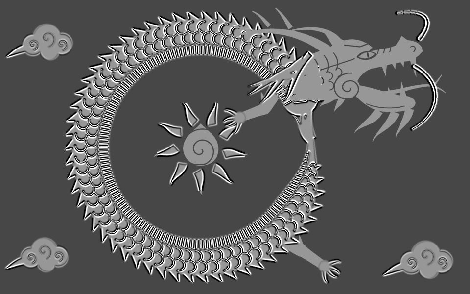
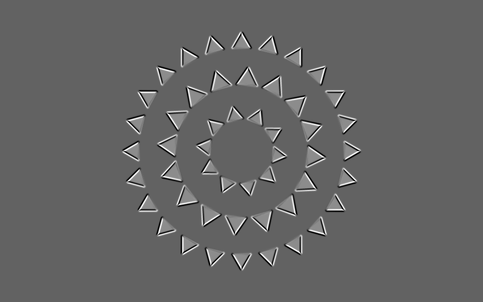
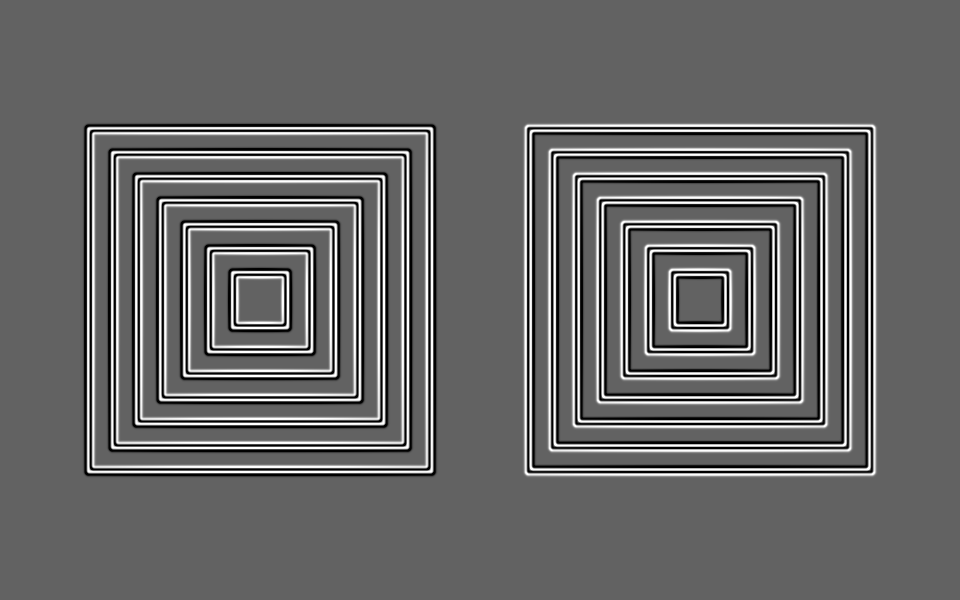
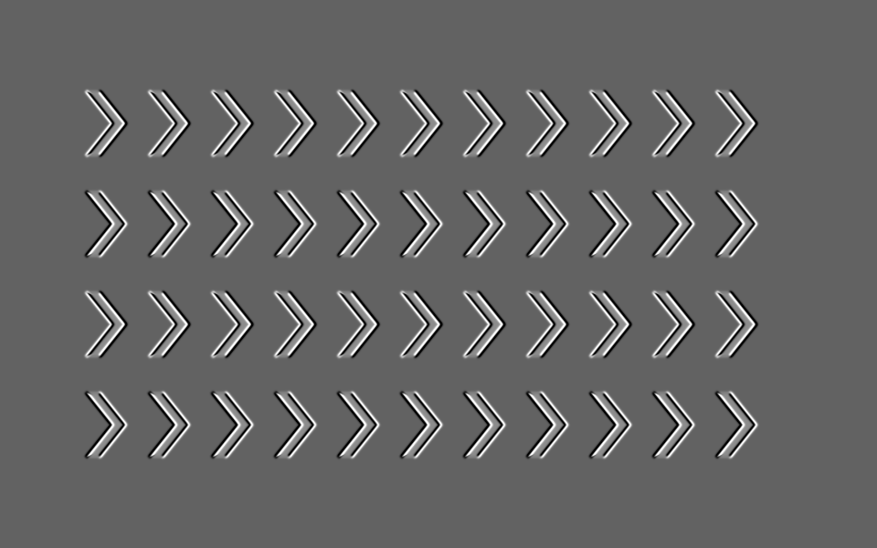

# 錯視ペイント

**止まっている絵が、動いて見える。**

形の位置や大きさを変えず、輪郭の明暗だけで動いて見えるアニメーションを作るペイントツールです。ブラウザで描いて、GIF・APNG・動画として保存できます。

**[ブラウザで使ってみる](https://unco3.github.io/illusion-paint/)** · [作品を見てみる](https://unco3.github.io/illusion-paint/samples/)

<a href="https://unco3.github.io/illusion-paint/showcase/">
  
</a>

**逆鱗 — 動かない龍。** 鱗が流れて見えても、下絵の位置は変わりません。[作品ページ](https://unco3.github.io/illusion-paint/showcase/)では固定した輪郭を重ねて比較できます。編集用データをダウンロードして、自分で動きの設定を変えることもできます。

## こんな錯視を作れます

| 回転 | 拡大・縮小 | 移動 |
| :---: | :---: | :---: |
| [](https://unco3.github.io/illusion-paint/samples/) | [](https://unco3.github.io/illusion-paint/samples/) | [](https://unco3.github.io/illusion-paint/samples/) |
| 止まった歯車 | 息をする四角 | 流れない川 |

どれも、図形そのものの位置・角度・大きさは固定です。[サンプル一覧](https://unco3.github.io/illusion-paint/samples/)で一つずつ再生し、下絵と見比べられます。見え方の強さは、見る人や表示サイズによって異なります。

## 使い方

[基本操作を動画で見る](https://unco3.github.io/illusion-paint/tutorial/)。アプリ上部の「使い方」からも開けます。

1. 線・図形・文字で描くか、画像を読み込みます。
2. 「形を選択」、矩形範囲、投げ縄で動かしたい範囲を選びます。
3. 回転・移動・拡大・縮小を設定し、「再生」で確認します。
4. 「書き出し」からGIF・APNG・動画を保存できます。動画形式はブラウザにより異なります。

書き出し中は「書き出しを中止」またはEscで中断できます。

複数選択による動きの一括設定、描画レイヤー、コントラスト調整、文字書式、ベジェパスに沿った複製配置にも対応しています。

## 保存について

- ツール設定は利用中のブラウザに保存されます。別の端末やURLへの自動同期はありません。
- 読み込んだフォントは12個まで保存できます。文字設定で読み込み済みのフォントを選び、「読み込んだフォントを削除」で整理できます。
- 作品を再編集する場合は「ファイル → プロジェクトを保存」でJSONを保存し、再開時に読み込んでください。描画内容は自動保存されません。
- 編集後にページを閉じる・再読み込みする際は、ブラウザの確認が表示されます。ブラウザや端末の強制終了からは保護できないため、作業中もJSONを保存してください。
- 読み込んだ画像・フォント・作品はブラウザ内で処理します。アプリから外部サーバーへアップロードする機能はありません。

## 動作環境

最新のデスクトップブラウザを想定しています。公開準備の動作検証はChromiumで行っています。Safari・Firefox・iOS実機での網羅的な検証は未実施です。

- GIFはアプリ内のエンコーダーで作成します。
- APNGにはブラウザの`CompressionStream`が必要です。非対応の場合は画面に理由を表示します。
- 動画には`MediaRecorder`とCanvasの`captureStream`が必要です。利用可能な形式に応じてMP4またはWebMを保存します。
- 設定はlocalStorage、読み込んだフォントはIndexedDBを使用します。保存を制限したブラウザでは、リロード後の保持ができない場合があります。

細かい投げ縄やベジェ編集には、マウス・ペンが使える大きな画面を推奨します。

## 配布ファイル

`index.html` にHTML・CSS・JavaScriptをまとめています。追加ライブラリ、APIキー、データベース、ビルド環境は不要です。

`samples/`にはサンプル一覧と3つの基本作品、`showcase/`には龍の作品ページ・比較サンプル・完成PV・ダウンロード用ZIP、`tutorial/`には基本操作の説明動画とチャプター付きの視聴ページを収録しています。制作・検証スクリプトやPVの中間素材は配布フォルダに含めていません。

作品ページも公開するには、`index.html`だけでなく、このフォルダ内のファイルとサブフォルダをまとめて配信してください。アプリ上部の「作品」から龍とサンプル一覧を開けます。

このフォルダを静的ホスティングで配信するか、ダウンロードした `index.html` をブラウザで開いて利用できます。設定の保存可否や動画形式は、ブラウザの機能・設定に依存します。

GitHub Pagesの公開元には、このフォルダの内容を置いたリポジトリのルートを指定してください。

## ライセンスとクレジット

ダウンロード・利用・改変・再配布・商用利用ができます。

| 対象 | ライセンス |
| --- | --- |
| アプリ・WebページのHTML / CSS / JavaScriptコード | [MIT](LICENSE) |
| 配布サンプルのJSON、画像・GIF・APNG、動画、説明文 | [CC BY 4.0](LICENSE-CC-BY-4.0.txt) |

著作者は **unco3**、出典は **https://github.com/unco3/illusion-paint** です。アプリや素材を再配布するときは、この名前・リンクと該当するライセンス表示を残してください。ダウンロード用パッケージなら、[NOTICE](NOTICE)と該当ライセンス文書の同梱で対応できます。CC BY 4.0の素材を改変した場合は、変更した旨も記載してください。画面への常時表示や、別途の宣伝・紹介投稿は必要ありません。

配布素材のクレジット例です。

```text
Illusion Paint — unco3
https://github.com/unco3/illusion-paint
CC BY 4.0 — https://creativecommons.org/licenses/by/4.0/
変更内容：色と動きの設定を変更（改変した場合）
```

**利用者が自分で描いた新作には、unco3へのクレジットは不要です。** 配布サンプルを流用・改変した作品には、CC BY 4.0の条件が適用されます。読み込んだ第三者の画像やフォントについては、その権利者の条件を確認してください。
